<div align="center">



<br/>

[](https://laravel.com/)
[](https://vuejs.org/)
[](https://maildrop-620d.onrender.com/)
[](https://github.com/dvphnc)
[](https://maildrop-620d.onrender.com/)

</div>


---


## What is MailDrop?

MailDrop is a pay-per-send email delivery platform built for simplicity.

> You don't need a full email marketing suite to send one meaningful message. No accounts. No subscriptions. Just fill a form, pay with PayPal, and your email lands in seconds — with a file attached if you need it.

MailDrop is a place where sending a one-off email feels intentional. Every send is gated behind a PayPal payment, so nothing goes to waste. The interface is dark, minimal, and fast — built to get out of the way.

This started as a school activity — a PayPal integration exercise for class. It turned into one of the things I'm most proud of building.

---

## What I Built

> A full-stack Laravel + Vue 3 application with Inertia.js, PayPal Sandbox API integration, real email delivery, and a live preview experience that updates as you type.

<details>
<summary>&nbsp;<b>The send experience</b></summary>
<br/>
A split-layout form with a live email preview on the right side. As you type your name, email, and message, the preview updates in real time — showing exactly how your email will look to the recipient before you pay. A completeness bar at the bottom tracks how much of the form you've filled.
</details>

<details>
<summary>&nbsp;<b>PayPal payment flow</b></summary>
<br/>
Clicking "Send Email" opens a modal with an adjustable amount input, preset buttons ($5, $10, $25, $50), and sandbox test credentials shown right inside the modal. After payment is confirmed, the email sends automatically — no second step needed.
</details>

<details>
<summary>&nbsp;<b>Drag & drop attachments</b></summary>
<br/>
Drop a file onto the dropzone or click to browse. The zone highlights green when a file is dragged over, then shows the filename and size after selection — with a remove button to clear it. Files are saved temporarily on the server, sent with the email, then deleted immediately after.
</details>

<details>
<summary>&nbsp;<b>Email history dashboard</b></summary>
<br/>
A searchable table of every email sent through MailDrop — sender, recipient, message preview, attachment badge, amount paid, delivery status, and timestamp. Each row has a delete button that removes the record instantly without reloading the page.
</details>

<details>
<summary>&nbsp;<b>The landing page</b></summary>
<br/>
A full marketing page with a custom green cursor with a trailing ring, scroll-reveal animations on every section, a marquee ticker, a stats bar, a how-it-works grid, a features section, and three pricing cards. Everything animates in with staggered cubic-bezier easing as you scroll.
</details>

---

## Built With

```
Laravel 11        Backend, routing, mail, migrations
Vue 3             Frontend components with Composition API
Inertia.js        SPA feel without a separate API
PayPal SDK        Sandbox payment processing
Resend API        Email delivery via HTTP (no SMTP blocks)
Vite              Asset bundling and hot reload
Docker            Containerized production build
Render            Hosting and automatic deployment
SQLite            Lightweight database
```

---

## Run It Locally

> Clone the repo, install dependencies, and you're running in under a minute.

```bash
git clone https://github.com/dvphnc/maildrop.git
cd maildrop
composer install
npm install
cp .env.example .env
php artisan key:generate
php artisan migrate
npm run dev
```

Open a second terminal:

```bash
php artisan serve
```

Open `http://localhost:8000` and you're in.

---

## How It's Organized

```
maildrop/
│
├── app/
│   ├── Http/Controllers/
│   │   ├── EmailController.php       email form and sending
│   │   ├── PayPalController.php      PayPal order creation and capture
│   │   └── DashboardController.php   email log CRUD
│   ├── Mail/
│   │   └── SendEmailMail.php         mailable with attachment support
│   └── Models/
│       └── EmailLog.php              sent email record
│
├── resources/
│   ├── js/Pages/
│   │   ├── Welcome.vue               landing page with animations
│   │   ├── SendEmail.vue             split layout form + live preview
│   │   ├── Dashboard.vue             email history with search and delete
│   │   └── Success.vue               animated success page
│   └── views/
│       ├── app.blade.php             Inertia root layout
│       └── emails/sendmail.blade.php HTML email template
│
├── routes/
│   └── web.php                       all application routes
│
├── database/
│   └── migrations/                   SQLite schema
│
├── public/
│   └── build/                        compiled Vite assets
│
└── Dockerfile                        Docker config for Render
```



## Testing Payments

MailDrop runs in **PayPal Sandbox mode**. Use these test credentials on the checkout page:

```
Email:    maildrop.buyer@personal.example.com
Password: MailDrop@2026
```

No real money involved. The credentials are also shown inside the PayPal modal on the live app.


<div align="center">


<div align="center">


<sub>© 2026 MailDrop by Joana Daphne Sy.
<br> All Rights Reserved.</sub>

</div>
